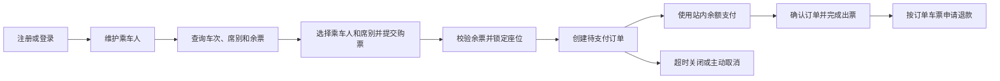
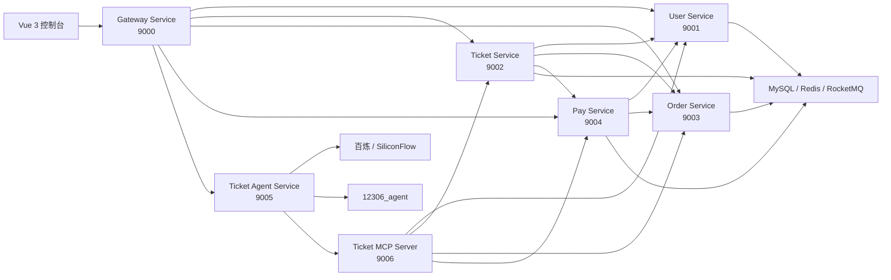

# Index12306 铁路购票与智能体系统

Index12306 是一个基于 Java 17、Spring Boot、Spring Cloud Alibaba 和 Vue 3 构建的微服务铁路购票项目。项目包含完整的传统购票业务，可以独立完成用户注册、乘车人管理、车票查询、购票下单、订单支付、取消订单和退票；同时提供独立的智能购票 Agent 与 MCP Server，允许用户通过自然语言安全地复用同一套业务能力。

## 项目能力

### 基础铁路购票

- 用户注册、登录、退出、资料维护、账户注销和站内余额管理。
- 乘车人新增、修改、删除与当前用户乘车人列表查询。
- 按出发地、目的地和乘车日期查询车次、席别、价格与余票。
- 购票参数校验、余票令牌预扣、座位选择与锁定、订单创建及库存更新。
- 本人订单分页查询、订单详情查询、未支付订单关闭与取消。
- 基于服务端订单金额的站内余额支付、支付记录查询和订单支付确认。
- 已支付车票退款、退款记录落库、余额退回与座位资源释放。
- 使用限流、风控、分布式锁、幂等控制和延迟消息保护高并发购票链路。

### 智能购票扩展

- 基于 Spring AI 的多模型路由、健康检查与故障降级。
- 使用确定性固定链完成意图规划和业务参数收集，模型不直接控制业务写接口。
- 通过 MCP Server 统一适配车次、乘车人、订单和支付查询能力。
- 购票、取消订单和退票必须生成业务草案，并由用户显式确认后执行。
- 使用一次性确认令牌、参数指纹和 `actionId` 防止越权、参数替换及重复写入。
- 使用数据库持久化操作状态，支持成功结果重放以及 `UNKNOWN` 结果的人工核对。
- 支持智能体历史会话、待确认操作和进行中工作流恢复。
- 提供操作成功率、执行耗时、确认过期、快照变化和结果未知等低基数指标。

## 基础购票流程

传统页面和智能体最终复用相同的业务服务，基础购票流程如下：



购票请求进入 `ticket-service` 后，会先完成参数与乘车人校验，再通过余票令牌、分布式锁和座位位图控制并发分配，随后调用 `order-service` 创建订单。`pay-service` 根据服务端订单数据确定支付金额，完成余额扣减并确认订单；未支付订单可由延迟消息关闭，取消或退款后由票务服务释放座位并回补余票资源。

## 系统架构



智能体写操作遵循固定安全链路：

```text
用户请求
→ 服务端意图规划与参数校验
→ 只读 MCP 查询最新业务状态
→ 生成不可执行草案
→ 用户显式确认
→ 再次校验业务快照
→ 专用执行器调用隐藏写工具
→ 持久化状态和脱敏结果
```

回答模型不会获得购票、取消订单或退票写工具。即使模型输出错误参数，也无法绕过用户确认、订单归属校验和业务服务幂等保护。

## 模块职责

| 模块 | 默认端口 | 主要职责 |
| --- | ---: | --- |
| `gateway-service` | 9000 | 统一入口、路由转发和登录态上下文传递 |
| `user-service` | 9001 | 用户、乘车人和站内余额管理 |
| `ticket-service` | 9002 | 车次余票查询、座位分配、购票、取消和退票编排 |
| `order-service` | 9003 | 订单及子订单创建、查询、关闭、取消和支付状态维护 |
| `pay-service` | 9004 | 站内余额支付、支付单查询、退款和余额回补 |
| `aggregation-service` | 9005 | 公网演示模式的受限操作配置，不属于基础购票必需链路 |
| `ticket-agent-service` | 9005 | 智能对话、任务规划、会话记忆、确认状态机和模型路由 |
| `ticket-mcp-server` | 9006 | 将传统业务接口安全适配为智能体可调用的 MCP 工具 |

`aggregation-service` 与 `ticket-agent-service` 的默认端口都是 `9005`。两者需要同时运行时，应通过 `TICKET_AGENT_SERVER_PORT` 调整 Agent 端口，或修改聚合服务端口。

```text
index12306
├── services                    # 传统铁路购票微服务
├── ai-services                 # Agent 与 MCP 智能购票扩展
├── frameworks                  # 公共 Spring Boot Starter
├── console-vue                 # Vue 3 购票页面和智能购票页面
├── resources_sql_sharded       # 业务数据库初始化及升级 SQL
└── docs/agent                  # 智能体架构、安全和阶段验收文档
```

## 环境要求

- JDK 17
- Maven Wrapper（仓库已包含）
- Node.js、Yarn
- MySQL
- Redis
- Nacos
- RocketMQ

## 数据库与关键配置

### 基础业务数据库

`resources_sql_sharded` 提供了传统购票业务所需的建表、基础数据和升级脚本：

- `ticket-service` 使用单库 `12306_ticket`。
- `user-service` 使用分片库 `12306_user_0`、`12306_user_1`。
- `order-service` 使用分片库 `12306_order_0`、`12306_order_1`。
- `pay-service` 使用分片库 `12306_pay_0`、`12306_pay_1`。
- 全新环境先导入 `resources_sql_sharded/db`，再导入 `resources_sql_sharded/data`。
- 已有数据库根据实际版本按需执行 `resources_sql_sharded/upgrade` 中的升级脚本。

启动前需要检查各服务的 `application.yaml` 和 `shardingsphere-config.yaml`，将 MySQL、Redis、Nacos、RocketMQ 地址及账号密码调整为本地环境配置。

### 智能体配置

启用智能购票扩展时，还需要配置以下环境变量：

```text
AGENT_DATASOURCE_URL=jdbc:mysql://127.0.0.1:3306/12306_agent
AGENT_DATASOURCE_USERNAME=root
AGENT_DATASOURCE_PASSWORD=your-password

NACOS_SERVER_ADDR=127.0.0.1:8848
ROCKETMQ_NAME_SERVER=127.0.0.1:9876

TICKET_MCP_INTERNAL_SECRET=至少32个字符的内部签名密钥
TICKET_AGENT_CONFIRMATION_SECRET=至少32个字符的独立确认密钥

BAILIAN_API_KEY=your-api-key
# 或
SILICONFLOW_API_KEY=your-api-key
```

不要把模型密钥、数据库密码或内部签名密钥提交到 Git。Agent 数据表由 `ticket-agent-service` 中的 Flyway 迁移自动创建。

## 本地启动

### 基础购票模式

1. 启动 MySQL、Redis、Nacos 和 RocketMQ。
2. 按前述顺序初始化业务数据库并修改各服务连接配置。
3. 启动 `user-service`、`order-service`、`pay-service` 和 `ticket-service`。
4. 启动 `gateway-service`。
5. 启动前端：

```bash
cd console-vue
yarn install
yarn serve
```

登录后可以通过以下页面完成传统购票操作：

- `/ticketSearch`：查询车次和余票。
- `/passenger`：管理乘车人。
- `/buyTicket`：确认乘车人和席别并提交订单。
- `/order`：查看和处理订单。
- `/myTicket`：查看本人车票。

### 智能购票模式

基础业务服务正常运行后，再配置模型与内部签名密钥，启动 `ticket-mcp-server` 和 `ticket-agent-service`。登录后进入 `/agent` 即可使用自然语言查询、购票、取消订单和退票。

## 构建与测试

编译整个 Maven 工程：

```powershell
.\mvnw.cmd -DskipTests package
```

运行智能体和 MCP Server 测试：

```powershell
.\mvnw.cmd -pl ai-services/ticket-agent-service -am test
.\mvnw.cmd -pl ai-services/ticket-mcp-server -am test
```

运行传统购票服务测试：

```powershell
.\mvnw.cmd -pl services/user-service,services/ticket-service,services/order-service,services/pay-service -am test
```

构建前端：

```bash
cd console-vue
yarn build
```

## 可观测性

传统业务服务集成了 Spring Boot Actuator 和 Prometheus 指标注册器，可按各服务配置查看健康状态与运行指标。

Agent Service 通过 Actuator 暴露 `health`、`info` 和 `metrics` 端点。高风险操作重点指标包括：

- `agent.action.executions`
- `agent.action.execution.duration`
- `agent.action.confirmation.rejections`
- `agent.action.confirmation.expirations`

详细指标口径和真实环境验收步骤参见 [智能体高风险操作可观测性与验收](docs/agent/action-operation-observability.md)。

## 安全与一致性

- 车票查询和下单接口按用户或 IP 维度执行限流与风控校验。
- 购票链路通过余票令牌、分布式锁和座位位图降低超卖风险。
- 支付金额从订单服务端数据生成，不接受客户端指定金额。
- 用户订单查询、取消和退款均校验当前登录用户与订单归属。
- 余额扣减、余额退回和关键写操作使用业务标识保证幂等。
- 用户身份只从网关验证后的请求上下文获取，不采信模型参数。
- MCP 内部调用使用服务身份签名，并绑定用户、会话、轮次、操作和参数指纹。
- 写工具不会注册给回答模型，只能由确认后的专用执行器调用。
- 确认前会重新查询余票、订单状态、可退车票和预计退款金额。
- 网络超时或响应无法解析时标记为 `UNKNOWN`，禁止盲目自动重试。
- 操作结果只保存白名单脱敏字段，不保存证件号、确认令牌或支付渠道敏感凭证。

## 许可证

本项目遵循仓库 [LICENSE](LICENSE) 中声明的开源许可证。
