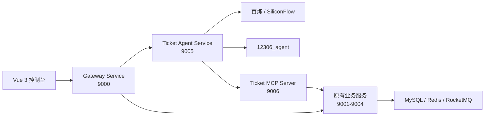

# Index12306 智能购票系统

Index12306 是一个基于 Java 17、Spring Boot、Spring Cloud Alibaba 和 Vue 3 构建的微服务铁路购票项目。本仓库在原有用户、车票、订单、支付和网关服务之上，新增了独立的智能购票 Agent 与 MCP Server，为用户提供车次查询、乘车人查询、历史会话恢复，以及购票、取消订单和退票的安全智能化流程。

## 核心能力

- 完整的用户、车票、订单、支付和网关微服务。
- 基于 Spring AI 的多模型路由、健康检查与故障降级。
- 使用确定性固定链完成意图规划和业务参数收集，模型不直接控制业务写接口。
- 通过 MCP Server 统一适配车次、乘车人、订单和支付查询能力。
- 购票、取消订单和退票必须生成业务草案，并由用户显式确认后执行。
- 使用一次性确认令牌、参数指纹和 `actionId` 防止越权、参数替换及重复写入。
- 使用数据库持久化操作状态，支持成功结果重放以及 `UNKNOWN` 结果的人工核对。
- 支持智能体历史会话、待确认操作和进行中工作流恢复。
- 提供操作成功率、执行耗时、确认过期、快照变化和结果未知等低基数指标。

## 系统架构



智能体写操作遵循固定安全链路：

```text
用户请求
→ 服务端意图规划与参数校验
→ 只读 MCP 查询最新业务状态
→ 生成不可执行草案
→ 用户显式确认
→ 再次校验业务快照
→ 专用执行器调用隐藏写工具
→ 持久化状态和脱敏结果
```

回答模型不会获得购票、取消订单或退票写工具。即使模型输出错误参数，也无法绕过用户确认、订单归属校验和业务服务幂等保护。

## 项目结构

```text
index12306
├── ai-services
│   ├── ticket-agent-service    # 对话、工作流、记忆、确认状态机和模型路由
│   └── ticket-mcp-server       # 业务接口到 MCP 工具的安全适配层
├── services
│   ├── gateway-service         # 统一网关，端口 9000
│   ├── user-service            # 用户与乘车人，端口 9001
│   ├── ticket-service          # 车票查询与购票，端口 9002
│   ├── order-service           # 订单服务，端口 9003
│   └── pay-service             # 支付与退款，端口 9004
├── frameworks                  # 公共 Spring Boot Starter
├── console-vue                 # Vue 3 管理端和智能购票页面
├── resources_sql_sharded       # 业务数据库初始化及升级 SQL
└── docs/agent                  # 智能体架构、安全和阶段验收文档
```

## 环境要求

- JDK 17
- Maven Wrapper（仓库已包含）
- Node.js、Yarn
- MySQL
- Redis
- Nacos
- RocketMQ

## 关键配置

生产或联调环境至少需要配置以下环境变量：

```text
AGENT_DATASOURCE_URL=jdbc:mysql://127.0.0.1:3306/12306_agent
AGENT_DATASOURCE_USERNAME=root
AGENT_DATASOURCE_PASSWORD=your-password

NACOS_SERVER_ADDR=127.0.0.1:8848
ROCKETMQ_NAME_SERVER=127.0.0.1:9876

TICKET_MCP_INTERNAL_SECRET=至少32个字符的内部签名密钥
TICKET_AGENT_CONFIRMATION_SECRET=至少32个字符的独立确认密钥

BAILIAN_API_KEY=your-api-key
# 或
SILICONFLOW_API_KEY=your-api-key
```

不要把模型密钥、数据库密码或内部签名密钥提交到 Git。Agent 数据表由 `ticket-agent-service` 中的 Flyway 迁移自动创建，原有业务数据库使用 `resources_sql_sharded` 下的初始化和升级脚本。

## 本地启动

1. 启动 MySQL、Redis、Nacos 和 RocketMQ，并初始化业务数据库。
2. 配置上述环境变量。
3. 依次启动 `user-service`、`order-service`、`pay-service`、`ticket-service`。
4. 启动 `ticket-mcp-server` 和 `ticket-agent-service`。
5. 启动 `gateway-service`。
6. 启动前端：

```bash
cd console-vue
yarn install
yarn serve
```

登录后进入 `/agent` 即可使用智能购票页面。

## 构建与测试

编译整个 Maven 工程：

```powershell
.\mvnw.cmd -DskipTests package
```

运行智能体和 MCP Server 测试：

```powershell
.\mvnw.cmd -pl ai-services/ticket-agent-service -am test
.\mvnw.cmd -pl ai-services/ticket-mcp-server -am test
```

构建前端：

```bash
cd console-vue
yarn build
```

## 可观测性

Agent Service 通过 Actuator 暴露 `health`、`info` 和 `metrics` 端点。高风险操作重点指标包括：

- `agent.action.executions`
- `agent.action.execution.duration`
- `agent.action.confirmation.rejections`
- `agent.action.confirmation.expirations`

详细指标口径和真实环境验收步骤参见 [智能体高风险操作可观测性与验收](docs/agent/action-operation-observability.md)。

## 安全约束

- 用户身份只从网关验证后的请求上下文获取，不采信模型参数。
- MCP 内部调用使用服务身份签名，并绑定用户、会话、轮次、操作和参数指纹。
- 写工具不会注册给回答模型，只能由确认后的专用执行器调用。
- 确认前会重新查询余票、订单状态、可退车票和预计退款金额。
- 网络超时或响应无法解析时标记为 `UNKNOWN`，禁止盲目自动重试。
- 操作结果只保存白名单脱敏字段，不保存证件号、确认令牌或支付渠道敏感凭证。

## 许可证

本项目遵循仓库 [LICENSE](LICENSE) 中声明的开源许可证。
